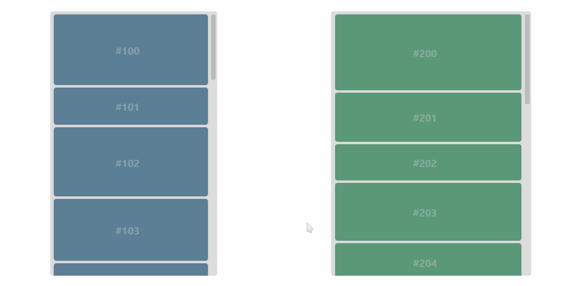

Vue Dragon🐉drop💧
---


A dead-simple Drag & Drop implementation relying on mouse events.

Highlights:
- no HTML5 Drag & Drop API
- simple code design
- No dependencies (VueJS 2.x is the only peerDependency)

The project is inspired by [vue-slicksort](https://github.com/Jexordexan/vue-slicksort).

Key changes:
- `manager` does almost all the things (state management, updating containers, scrolling, moving the helper, managing the ghost, etc.)
- `Container` only stores its unique props like `group`, `hideSortableGhost`, `direction`, etc.
- window/container scroll had been rethought (sometimes you should use client coordinates and sometimes document ones)
- position calculations simplified
- moving array elements interface changed
- `eventManager` made more consistent


## Who may find it useful?

I started the project mostly for ***educational*** purposes. So my focus is clear code design and keeping things really simple.

If you have to implement DnD yourself or just want to study how to do that maybe you are in the right place.

If you are looking for a full-featured library take a look at Jexordexan's vue-slicksort.


## Usage

```js
import Vue from 'vue';
import { vddContainer as Container, vddElement as Draggable } from 'vue-dragondrop';

const app = new Vue({
    el: '#app',
    data(){
        return {
            items: [
                {id: 0, text: 'Item 0'},
                {id: 1, text: 'Item 1'},
                {id: 2, text: 'Item 2'},
            ],
        }
    },

    components: {
        Container,
        Draggable
    },

    template: `
        <div id="app">
            <Container :list="items">
                <Draggable
                    v-for="(item,idx) in list" :key="item.id"
                    class="item" :index="idx" :item="item"
                >@{item.text}</Draggable>
            </Container>
        </div>
    `,
});
```

## Code design

```js
Container
    hideSortableGhost

Element
    onHover
    onLeave

Manager
    helper              // helper node following the pointer
    setHelper

    ghost               // preview node
    setGhost
    hideGhost
    revealGhost

    updateContainer
    autoscroll

    // main handlers
    onPress
    onMove
    onDrop
```

## Features

#### Supported
- vertical containers
- sorting elements within a container
- moving elements between containers
- vertical containers can have different width
- on drop animation (the dropped element flies to its new position)
- window scroll
- container scroll


#### Upcoming
- `Container.group` logic (allows moving elements only between containers within a group)
- horizontal containers (they should work already but it needs testing)
- locking X,Y axes
- treating the helper center as a pointer (it makes sorting smoother)

